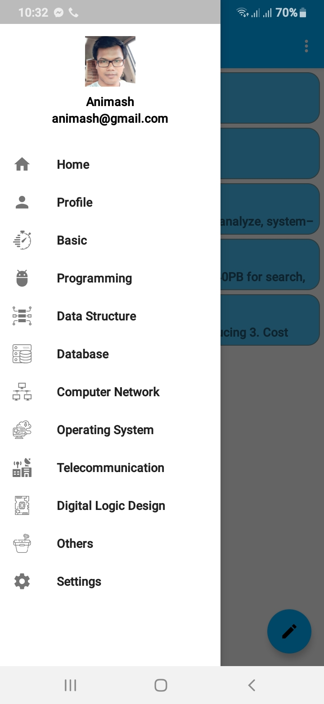
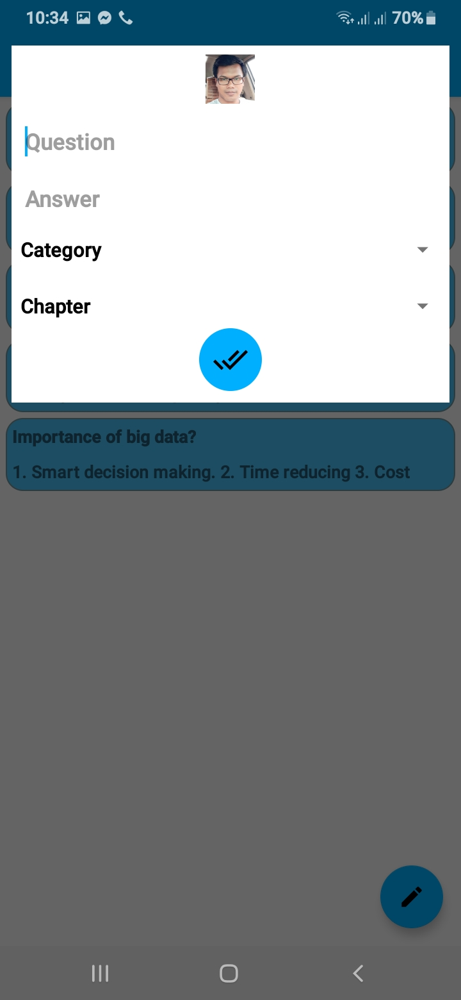
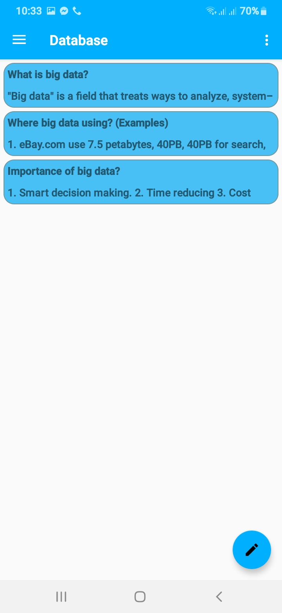
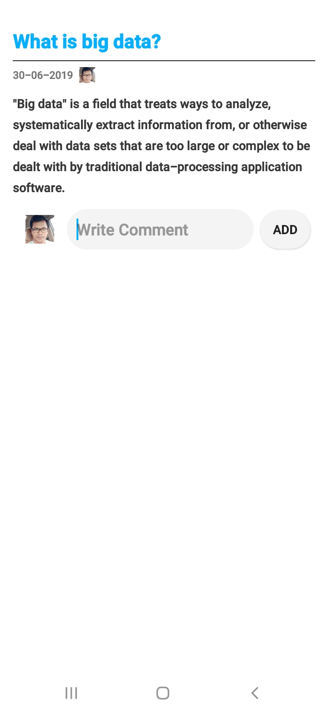

# ItBlogApp
> _This app create for IT basic to advance questions and answers_

### Focus on
* Using Signup by email, and login
* Using Fragments, RecyclerView, Retrofit2, Gson, Picasso
* Add IT question with answer for another user and learn
* Learn IT Chapter by chapter

#### Some Screenshots of this app
 Home Screen                            | Add answer and question                             | Learn                         		      | Details                         		                                  
:------------------------------------------:|:-------------------------------------------:|:-------------------------------------------:|:-------------------------------------------:
  |  |  |  
